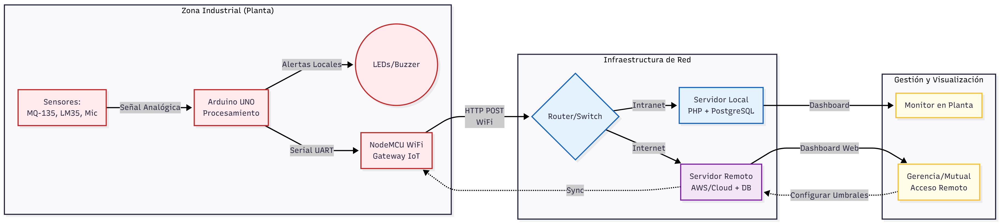

# 🏭 Safe Worker Security Monitor (IIoT System)

> **Sistema de monitoreo ambiental industrial para la prevención de riesgos laborales, con arquitectura distribuida (Local/Remota) y alertas en tiempo real.**

## 📖 Descripción general
[cite_start]Safe Worker es una solución tecnológica diseñada para proteger la salud de trabajadores en entornos industriales expuestos a condiciones nocivas[cite: 756]. El sistema monitorea continuamente variables críticas (Gases tóxicos, Temperatura, Ruido) y alerta inmediatamente sobre niveles peligrosos.

[cite_start]El diferenciador clave de este proyecto es su **arquitectura de red híbrida**: garantiza la operatividad visualizando datos en un **Servidor local** (en caso de corte de internet) y sincroniza simultáneamente con un **Servidor remoto** para la gestión centralizada y análisis estadístico[cite: 1089].

## 🧩 Diagrama de arquitectura del sistema

> **Diagrama de arquitectura:**
>
> 
>

## ⚙️ Arquitectura de hardware y sensores
El dispositivo integra microcontroladores y sensores calibrados para la detección precisa:

* [cite_start]**Microcontroladores:** Integración de **Arduino UNO** (adquisición de datos) con módulo **NodeMCU/ESP8266** (Gateway WiFi)[cite: 1132].
* **Sensores Implementados:**
    * [cite_start]🌡️ **Temperatura:** LM35 (Rango 55°C a 150°C)[cite: 1182].
    * [cite_start]☣️ **Calidad del aire/gases:** MQ-135 calibrado para detectar Amoníaco, CO2, CO y Tolueno[cite: 1189, 1234].
    * [cite_start]🔊 **Contaminación acústica:** Módulo MAX9812 con micrófono electret para medición de decibeles[cite: 1238].
* [cite_start]**Actuadores:** Sistema de alerta visual (LEDs Verde/Rojo) y sonora en el sitio[cite: 870].

## 💻 Stack de software y funcionalidades

* [cite_start]**Backend y API:** PHP para la recepción de peticiones HTTP (POST/GET) desde los microcontroladores[cite: 1537].
* [cite_start]**Base de Datos:** **PostgreSQL** para el almacenamiento de logs de incidencias, valores en tiempo real y configuración de parámetros[cite: 1133].
* [cite_start]**Frontend:** Interfaz web responsiva para visualizar semáforos de estado, gráficos de incidencias y modificar umbrales de alerta remotamente[cite: 1343, 1455].
* [cite_start]**Protocolos:** Comunicación Serial (Arduino <-> NodeMCU) y HTTP sobre WiFi (NodeMCU <-> Servidores)[cite: 1262, 1522].

## 🚀 Highlights del proyecto
* [cite_start]**Tolerancia a fallos de red:** Implementación de servidor local para asegurar que la seguridad de la planta no dependa de la conexión a internet externa[cite: 1089].
* [cite_start]**Calibración matemática:** Implementación de curvas logarítmicas y fórmulas de conversión de voltaje a unidades físicas (ppm, dB, °C) directamente en el firmware[cite: 1222, 1248].
* [cite_start]**Gestión centralizada:** Panel de administración para configurar remotamente los límites permitidos de cada gas o ruido sin reprogramar el hardware[cite: 1356].

---
*Proyecto desarrollado para la asignatura de TICs I por:
    * Fernanda Lorca
    * Catalina Lorca
    * Rafael Campos
       
Enfocado en seguridad industrial y normativa laboral chilena.*
